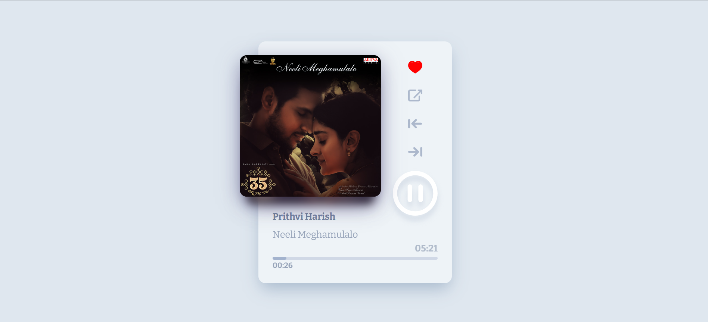

# 🎵 Music Player

A simple and responsive web-based music player that allows users to play, pause, and switch between multiple tracks. Built using HTML, CSS, and JavaScript.



---

## 🚀 Features

- Play/Pause functionality
- Next/Previous track
- Dynamic UI with album art
- Responsive design for desktop
- Easy-to-use interface

---

## 🛠️ Tech Stack

- **HTML5**
- **CSS3**
- **JavaScript**

---

---

## 📦 How to Use

1. Clone the repo:
   ```bash
   git clone https://github.com/amulyasutraye/music-player.git
2. Open index.html in your browser and enjoy!
